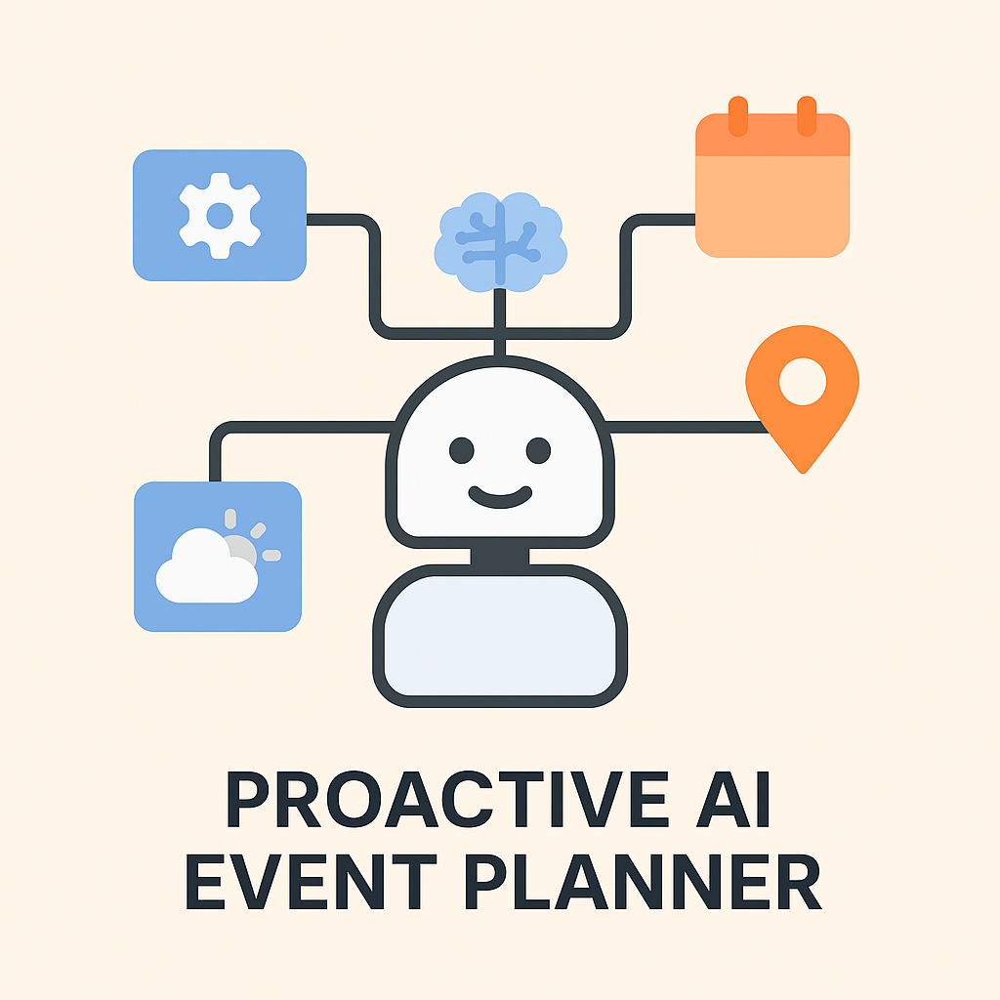

HEAD
# Proactive-AI-Event-Planner




[](https://medium.com/@akankshasinha30421)
[](https://github.com/akankshasinhagithub)

# 🤖 Proactive AI Event Planner


This project demonstrates a multi-agent AI workflow using **LangChain-inspired design**, **function calling**, and **simulated memory**. The system can proactively suggest weekend plans based on user preferences like “outdoor”, “food”, or “art”.

---

✅ 1. Final Workflow (in plain text)

📌 How it works:

1. 🧠 User enters a preference — e.g., "outdoor", "food", or "art".
2. 📎 `planner_agent.py` orchestrates the workflow.
    ├─ Uses `search_agent.py` to get local event suggestions.
    ├─ Uses `user_memory.py` to store the last plan (simulated memory).
    └─ Uses `notifier_agent.py` to display the weekend plan.
3. 📒 The entire system is coordinated like a multi-agent LLM pipeline.
4. 🔁 You can extend this system by adding more agents or real APIs later.


## 📊 Architecture & Workflow

```

             +-------------------+
             |   User Input      |
             |  (preference)     |
             +--------+----------+
                      |
                      v
             +--------+----------+
             |  Planner Agent    |   --> Orchestrates the whole flow
             +--------+----------+
                      |
         +------------+------------+
         |            |            |
         v            v            v
+----------------+ +-------------------+ +------------------+
| Search Agent   | | Memory Agent      | | Notification Agent|
| (get_local_...) | | (save & retrieve) | | (print plan to UI)|
+----------------+ +-------------------+ +------------------+

```


---

## 💻 How to Run Locally

```bash
git clone https://github.com/akankshasinhagithub/Proactive-AI-Event-Planner
cd Proactive-AI-Event-Planner
python main.py

🧠 Features
✅ Multi-agent collaboration
✅ Function-calling style architecture
✅ Simulated memory with Python dict
✅ Modular code structure
✅ Ready to scale with real APIs


📦 Project Modules
Module	               Role
planner_agent.py	   Orchestrates the flow. Handles user preferences
search_agent.py	       Returns mock events based on preference (e.g., “outdoor”)
user_memory.py	       Saves and retrieves past plans
notifier_agent.py	   Outputs the results to console
main.py	               Entry point to trigger planner agent


🌐 Scaling Plan
Phase	What’s Next?
V1	✅ CLI-based, mock data, single user memory
V2	🔗 Real API integration (e.g., Eventbrite, Google Places)
V3	🧠 Personalized user memory (by location, past behavior)
V4	🗓️ Sync with Google Calendar or iCal
V5	📲 Frontend via Streamlit, Flask or Telegram Bot
V6	🤖 LangGraph or ReAct agent with memory-enhanced reasoning
V7	📤 Notifications via WhatsApp, Email, Slack, SMS
V8	🗺️ Geo-localized search, weather-aware suggestions

## 🚀 Roadmap & Future Scope

This is a minimal, modular implementation of multi-agent orchestration — inspired by LangChain’s agentic workflows.

Here’s how this project can be extended further:

1. **🔗 Real API Integration**  
   Replace mock data in `search_agent.py` with real event APIs like Eventbrite, Meetup, or Google Events.

2. **🧠 Persistent Vector Memory**  
   Upgrade simulated memory using vector stores like FAISS or ChromaDB to personalize plans across time.

3. **📬 Multichannel Notifications**  
   Extend `notifier_agent.py` to send emails, Telegram messages, or calendar invites.

4. **🌍 Multi-Preference Support**  
   Accept combinations like `"outdoor+art"` and let agents negotiate or reason over the final plan.

5. **💬 Chat Interface**  
   Deploy with a frontend using Streamlit or Gradio for an interactive experience.

---

## 🛠️ Setup Instructions

1. Clone the repo  
   ```bash
   git clone https://github.com/akankshasinhagithub/Proactive-AI-Event-Planner.git
   cd Proactive-AI-Event-Planner

2. Create a virtual environment
python -m venv venv
source venv/bin/activate  # On Windows: venv\Scripts\activate

3. Install dependencies
pip install -r requirements.txt

4. Run the orchestrator (main.py)
python main.py

---

🔍 Example Usage
planner_agent("Plan a fun weekend with outdoor activities, food, and art events")


Output:
Planning based on preference: outdoor
🔎 Searching for events related to: outdoor
💾 Plan saved to memory

🗓️ Here's your weekend plan:
1. Hiking Tour
2. Botanical Garden Visit
3. Outdoor Yoga


---

✨ Update Workflow (to avoid broken imports)
Whenever you add a new agent, do this:

1. Make sure the folder is in the Python path:
import os, sys
sys.path.append(os.path.abspath("."))

2. Use relative imports inside submodules when calling other agents:
from agents.search_agent import get_local_events

3. Always test with main.py first — it helps debug better than Jupyter if import fails.


👩‍💻 **Author**  
Akanksha Sinha  
_Data Scientist | AI Engineer | Creator of #100DaysOfAI_  
[🔗 GitHub](https://github.com/akankshasinhagithub) | [🔗 LinkedIn](https://www.linkedin.com/in/akanksha247/)


🌟 Motivation
This isn't just a planner. It's a demonstration of how multiple lightweight agents can work together like an orchestra, with shared memory and reasoning capabilities. Built for Day 13–14 of the #100DaysOfAI challenge to simulate proactive AI workflows.
